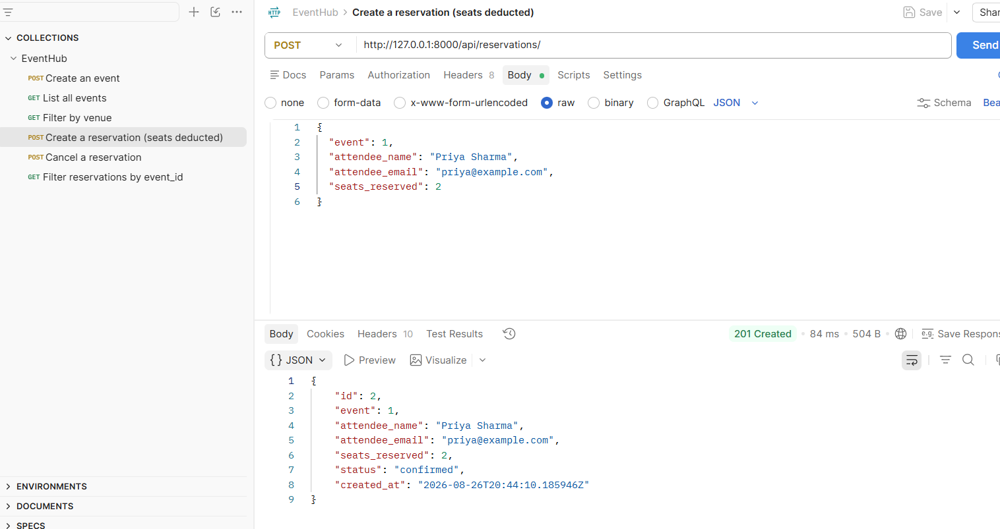
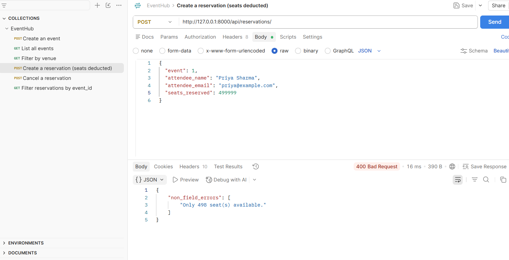
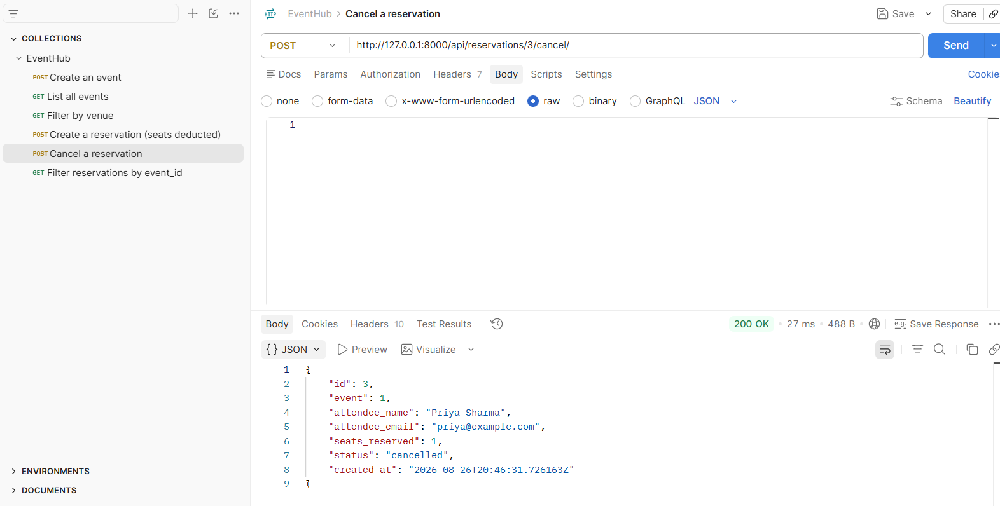

# EventHub

A backend API for a simplified event ticketing platform — browse events, reserve seats, cancel reservations.

## How to Run

1. Clone the repo: `git clone <repo-url>` then `cd eventhub-project`
2. Create and activate a virtual environment:
   - `python -m venv venv`
   - `.\venv\Scripts\Activate.ps1` (Windows)
3. Install dependencies: `pip install -r requirements.txt`
4. Run migrations: `python manage.py makemigrations` then `python manage.py migrate`
5. Start the server: `python manage.py runserver`
6. API available at `http://127.0.0.1:8000/api/`

## Endpoints

| Method | Endpoint                              | Description                          |
|--------|-----------------------------------------|----------------------------------------|
| GET/POST | /api/events/                         | List / create events                   |
| GET/PUT/DELETE | /api/events/{id}/               | Retrieve / update / delete an event    |
| GET    | /api/events/?status=upcoming           | Filter events by status                |
| GET    | /api/events/?venue=NIMHANS             | Filter events by venue (partial match) |
| GET/POST | /api/reservations/                   | List / create reservations             |
| GET    | /api/reservations/?event_id=1          | Filter reservations by event           |
| POST   | /api/reservations/{id}/cancel/         | Cancel a reservation, restore seats    |

## Design Decision

I deduct `available_seats` and create the `Reservation` inside the same 
`ReservationSerializer.create()` method rather than in the view, so both writes 
happen together in one place. I also chose to validate seat availability and event 
status inside the serializer's `validate()` method rather than the view, keeping 
all business rules for a reservation colocated with the data it validates. In a 
production system with concurrent bookings, this would need `transaction.atomic()` 
plus row locking to prevent two users overbooking the same last seat — out of 
scope for this assignment, but worth flagging as a known limitation.

## Postman Screenshots

### Successful Reservation (201 Created)

### Overbooking Failure (400 Bad Request)

### Successful Cancellation
